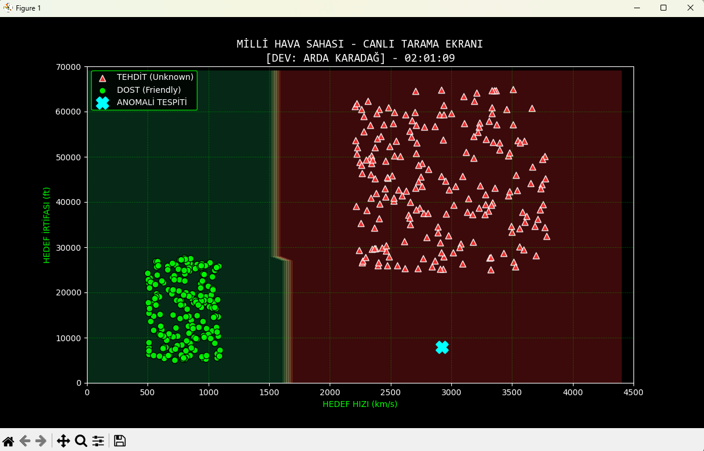

# 🎓 Eğitim Amaçlı: Basit Yapay Zeka Destekli Radar Simülasyonu

Bu proje, Python ve Makine Öğrenmesi (Machine Learning) öğrenme sürecimde geliştirdiğim, temel düzeyde bir **Radar Arayüzü Simülasyonu**dur. Gerçek bir radar sistemi değildir; algoritmaların mantığını kavramak amacıyla oluşturulmuş bir **prototiptir.**

## 🎯 Proje Amacı

Savunma sanayii yazılımlarının arka planda nasıl karar verdiğini anlamak amacıyla; rastgele üretilen hız ve irtifa verilerini kullanarak, basit bir Yapay Zeka modelinin "Dost" ve "Tehdit" ayrımını nasıl yapabileceğini simüle etmektir.

## 🚀 Temel Özellikler

* **Canlı Simülasyon:** Rastgele verilerle sürekli güncellenen, hareketli bir radar ekranı.
* **Basit Yapay Zeka:** `Random Forest` algoritması kullanılarak verilerin (Hız ve İrtifa) sınıflandırılması.
* **Görselleştirme:** Verilerin anlaşılır olması için renkli bölgelerle (Yeşil/Kırmızı) tehdit analizi.
* **Kayıt Sistemi (Log):** Ekranda görülen verilerin basit bir metin dosyasına (`.txt`) kaydedilmesi.
* **Modüler Yapı:** Kodların daha düzenli olması için hesaplama (`radar.py`) ve görüntüleme (`interface.py`) işlemlerinin ayrılması.

## 🛠️ Kullanılan Araçlar

Bu projeyi geliştirirken şu kütüphanelerden faydalandım:

* **Python** (Temel programlama)
* **Scikit-Learn** (Yapay Zeka mantığını kurmak için)
* **Matplotlib** (Grafik çizimi ve arayüz için)
* **Pandas & NumPy** (Veri üretimi ve yönetimi için)

## 📷 Ekran Görüntüleri

### 1. Radar Arayüzü (Canlı Simülasyon)
Sistemin çalıştığı anki radar ekranı. Kırmızı alanlar yapay zeka tarafından "Tehdit Bölgesi", yeşil alanlar "Güvenli Bölge" olarak belirlenmiştir. Mavi çarpı işareti (X) anomali tespitini gösterir.



### 2. Kara Kutu Kayıtları (Log Dosyası)
Sistem çalışırken arka planda otomatik olarak oluşturulan ve her taramanın özetini içeren metin belgesi.


## 💿 Nasıl Çalıştırılır?

1. Gerekli kütüphaneleri yükleyin:
```bash
pip install -r requirements.txt

```

2. Simülasyonu başlatın:

```bash
python interface.py

```

## 📝 Not

Bu proje **eğitim ve hobi amaçlı** geliştirilmiştir. Veriler tamamen sentetiktir (rastgele üretilmiştir) ve gerçek dünya senaryolarını birebir yansıtmayabilir.

**Geliştirici:** Arda Karadağ | Öğrenci Projesi

